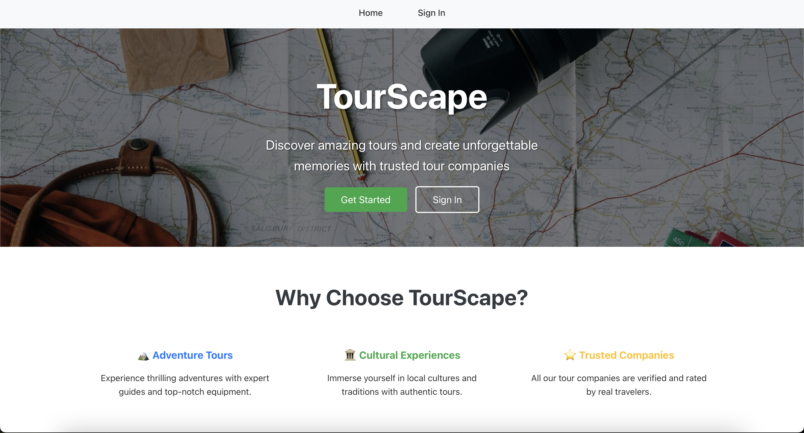
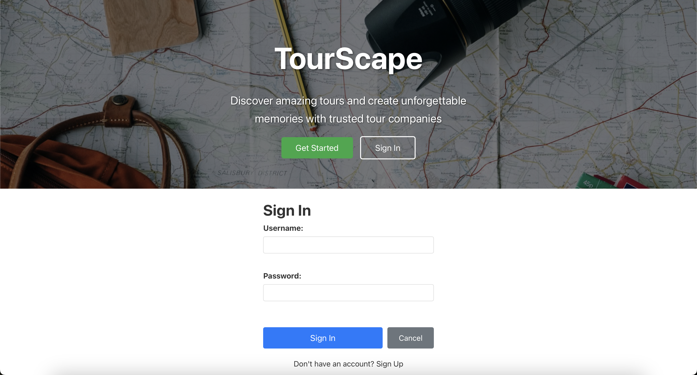
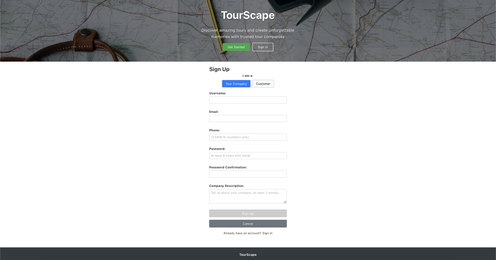
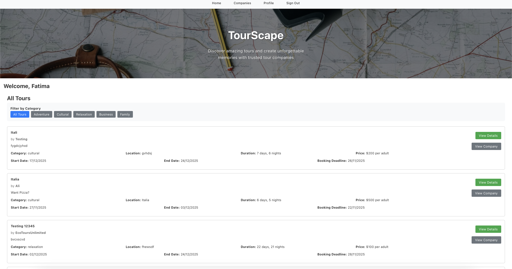
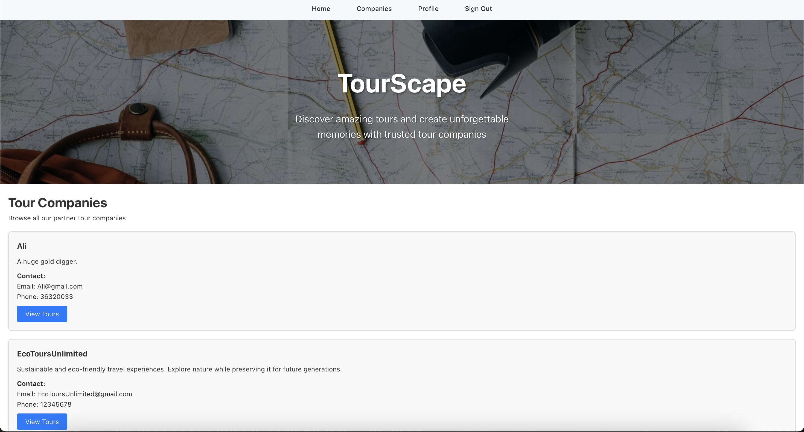
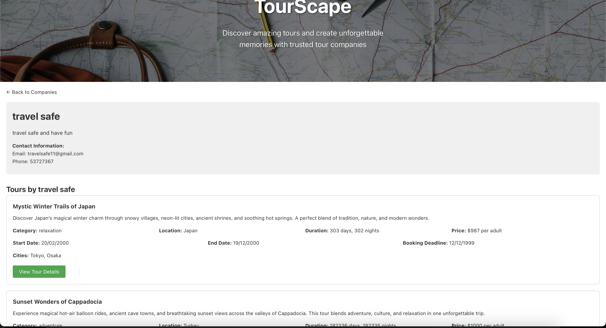
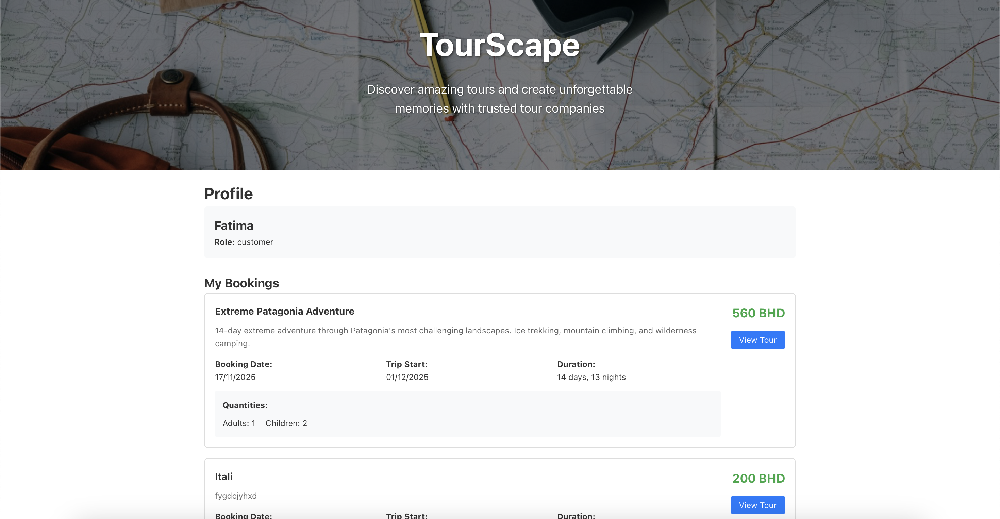
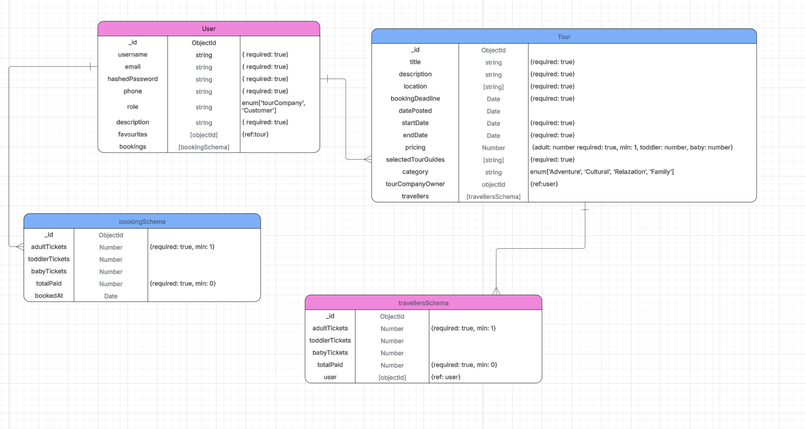

# TourScape

---

---

## 🎨 Project Title: TourScape

### What is TourScape?

**TourScape** is a comprehensive travel booking platform connecting travelers with professional tour companies. Multiple travel companies can showcase their curated itineraries, adventure packages, cultural tours, and relaxation getaways, while customers can browse, compare, and book their ideal travel experiences. The platform features specialized categories including:

- **Adventure:** Hiking, Trekking, Extreme Sports
- **Cultural:** Heritage Sites, Local Experiences, Historical Tours
- **Relaxation:** Spa Getaways, Beach Vacations, Wellness Retreats
- **Business:** Corporate Retreats, Conference Travel
- **Family:** Kid-friendly Activities, Family Packages

The website provides a seamless booking experience with real-time availability and comprehensive tour details.

---

## 🌟 Why This Project?

I built **TourScape** to create a digital marketplace that bridges the gap between tour providers and travelers. The platform empowers tour companies to reach wider audiences while giving customers a trusted way to discover and book unique travel experiences with verified providers.

---

## 🧠 User Concept Overview

### Customers (Travelers)
* Browse tours by category, country, city, and price range
* View detailed tour information: itineraries, pricing, dates, and company profiles
* Book tours with flexible party composition (adults, children, toddlers, babies)
* Track booking history and manage reservations
* Compare different tour companies and their offerings

### Tour Companies (Providers)
* Create and manage comprehensive tour listings
* Set dynamic pricing for different age groups and manage availability
* Monitor bookings, revenue analytics, and attendee statistics
* Showcase company profiles and build brand presence
* Manage tour schedules and booking deadlines

---

## ✅ Website Features

* Dual-role user authentication (Customer/Tour Company)
* Advanced tour filtering by category
* Comprehensive booking system with real-time availability
* Company profile pages with tour listings
* Booking management and history tracking
* Tour creation and management for companies
* Revenue and booking analytics for tour companies
* Responsive, mobile-friendly design

---

## 🚦 API Routes

### **1. Authentication Routes**

| Method | Route | Description |
| ------ | ----- | ----------- |
| POST | `/auth/sign-up` | User registration with role selection |
| POST | `/auth/sign-in` | User login and JWT token generation |

### **2. Tour Routes (Protected)**

| Method | Route | Description |
| ------ | ----- | ----------- |
| GET | `/tours` | Get all tours with filtering options |
| GET | `/tours/:tourId` | Get single tour details |
| POST | `/tours` | Create new tour (Tour Company only) |
| PUT | `/tours/:tourId` | Update tour (Owner only) |
| DELETE | `/tours/:tourId` | Delete tour (Owner only) |

### **3. Booking Routes (Protected)**

| Method | Route | Description |
| ------ | ----- | ----------- |
| POST | `/bookings` | Create new booking (Customer only) |
| GET | `/bookings` | Get user's booking history |

### **4. Company Routes (Protected)**

| Method | Route | Description |
| ------ | ----- | ----------- |
| GET | `/companies` | Get all tour companies |
| GET | `/companies/:companyId` | Get company profile with tours |

### **5. User Routes (Protected)**

| Method | Route | Description |
| ------ | ----- | ----------- |
| GET | `/users` | Get all users |
| GET | `/users/:id` | Get user profile |
| PUT | `/users/:id` | Update user profile |

---

## 🗂️ ERD Diagram

---
## Project Management

For detailed project tracking and task management, visit my Trello board:

[TourScape Trello Board](https://trello.com/invite/b/69060b3d4be2e78eabaf7882/ATTIff2ad63a2e4f05a90d163befd1d88ac5572C04E8/tourscape)

## 🚀 Getting Started

### 🖥️ Steps to Use TourScape

1. **Sign Up or Sign In**  
   * Create an account as either a Customer or Tour Company
   * Choose your role based on your needs

2. **Browse Tours**  
   * Explore tours by category: Adventure, Cultural, Relaxation, Business, Family
   * Use filters to find tours by location and price range
   * Click any tour to view detailed information

3. **Book Tours (Customers)**  
   * Select your party composition (adults, children, toddlers, babies)
   * View real-time pricing and availability
   * Complete booking with confirmation

4. **Manage Profile**  
   * View your booking history and upcoming trips
   * Update personal information and preferences
   * Track your travel experiences

5. **Create Tours (Tour Companies)**  
   * Add new tour listings with comprehensive details
   * Set pricing for different age groups
   * Manage availability and booking deadlines
   * Monitor bookings and revenue analytics

6. **Company Management**  
   * Build your company profile with description and contact info
   * Showcase all your available tours
   * Track booking statistics and attendee demographics

---

## Assets & Inspiration

The design and user experience for TourScape were inspired by modern travel platforms and booking systems, focusing on intuitive navigation and comprehensive tour discovery.

> This project is developed for educational purposes as part of a web development portfolio.

---

## 🧪 Technologies Used

* **Backend:** Node.js, Express.js
* **Frontend:** React 18, React Router DOM
* **Database:** MongoDB with Mongoose ODM
* **Authentication:** JWT (JSON Web Tokens), bcrypt for password hashing
* **State Management:** React Context API
* **Build Tool:** Vite
* **Styling & Layout:** Custom CSS with responsive design
* **HTTP Client:** Fetch API

---

## 🎯 Next Steps / Future Enhancements

1. Implement payment gateway integration (Stripe/PayPal)
2. Add reviews and rating system for tours and companies
3. Develop advanced search with geolocation and recommendations
4. Create real-time notifications for bookings and updates
5. Integrate social media sharing and user-generated content
6. Build admin dashboard for platform moderation
7. Add multi-language support for international users
8. Develop mobile application with React Native
9. Implement real-time chat between customers and companies
10. Add wishlist and tour comparison features

---

## Developed By

1. Fatima Khamis
2. Saraa Hameed
3. Adbulla Alsahi

---